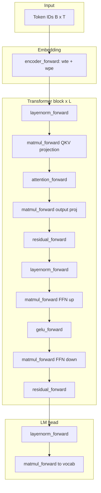

# GPT-2 inference architecture

## High-level flow

GPT-2 (124M) is a **decoder-only** transformer. This repository implements the
**forward pass (inference)** in CUDA.

## Active kernel set (`kernels/`)

| Kernel | Variant source | Role |
|--------|----------------|------|
| `encoder.cuh` | M1 baseline | Token + position embedding |
| `layernorm.cuh` | `layernorm-softmax-reduction` | Layer normalization |
| `matmul.cuh` | `matmul-cp-async-pipeline` | FFN + projection GEMM |
| `attention.cuh` | `attention-kv-cache` | Multi-head attention + cache |
| `softmax.cuh` | `layernorm-softmax-reduction` | Causal softmax |
| `gelu.cuh`, `residual.cuh` | M1 baseline | Activation + skip connection |

## KV-cache (`attention-kv-cache`)

When `g_enable_kv_cache = true` (see `verify_kv_cache`):

1. **Prefill** — full prompt; store K/V per layer.
2. **Decode** — one token; attend over cached K/V via `decode_attention_kernel`.

Globals: `src/kv_cache_globals.cu`.

## Code map

| Path | Description |
|------|-------------|
| `gpt2.cuh` | Model struct, `gpt2_forward` |
| `kernels/` | Active GPU code (compiled) |
| `kernels_baseline/` | Milestone-1 reference |
| `kernels_optimized/` | Frozen optimized snapshot |
| [`variants/`](../variants/) | Named optimization experiments |
| `cpu_kernels/` | CPU reference for tests |
